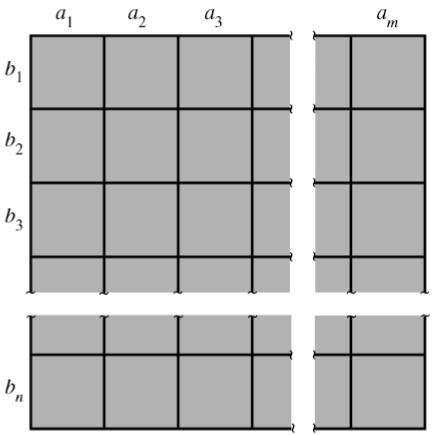

### Foundations

An **experiment** is the process by which an observation is made.

A statistical experiment involves the observation of a **sample** selected from a larger body
of data, existing or conceptual, called a **population**.

When an experiment is performed, it can result in one or more outcomes, 
which are called **events**.

A **simple** event is an event that cannot be decomposed. 
Because sets are collection of points, we associate a distinct point, 
called a **sample point**, with each and every simple event associated with an experiment.

The letter $E$ with a subscript will be used to denote a simple event or the corresponding sample point.

The **sample space** associated with an experiment is the set consisting of all possible sample points.
A sample space will be denoted by $S$.

A **discrete** sample space is one that contains either a finite or a countable number of distinct sample points.

An **event** in a discrete sample space $S$ is a collection of sample points—that is, any subset of $S$.

Suppose $S$ is a sample space associated with an experiment. To every event $A$ in $S$
($A$ is a subset of $S$), we assign a number, $P(A)$, called the **probability** of $A$,
so that the following axioms hold:

Axiom 1: $P(A) \geq 0$. \
Axiom 2: $P(S)=1$. \
Axiom 3: If $A_1, A_2, A_3, \dots$ form a sequence of pairwise mutually exclusive events
in $S$ (that is, $A_i \cap A_j = \emptyset$ if $i \neq j$), then

$$ P(A_1 \cup A_2 \cup A_3 \cup \dots) = \sum_{i=1}^{\infty} P(A_i).  $$

We can easily show that Axiom 3, which is stated in terms of an infinite sequence of events,
implies a similar property for a finite sequence.

Specifically, if $A_1, A_2, \dots, A_n$ are pairwise mutually exclusive events, then
$$ P(A_1 \cup A_2 \cup A_3 \cup \cdots \cup A_n) = \sum_{i=1}^{n} P(A_i). $$

If $A$ is an event, then
$$ P(A) = 1-P(\overline{A}). $$

### Useful results from the theory of combinatorial analysis

With $m$ elements $a_1, a_2, \dots, a_m$ and $n$ elements $b_1, b_2, \dots, b_n$,
it is possible to form $mn = m \times n$ pairs containing one element from each group.

{width=35% fig-align="center"}

The $mn$ rule can be extended to any number of sets. Given three sets of elements—$a_1, a_2, \dots, a_m;
b_1, b_2, \dots, b_n;$ and $c_1, c_2, \dots, c_p$—the number of distinct
triplets containing one element from each set is equal to $mnp$.

An **ordered arrangement** of $r$ distinct objects is called a **permutation**.
The number of ways of ordering $n$ distinct objects taken
$r$ at time will be designated by the symbol $P^n_r$. In a permutation, the order matters:
arranging the same objects in a different order gives a different permutation.

$$ P_r^n = n (n-1) (n-2) \cdots (n-r+1) = \frac{n!}{(n-r)!}. $$

The number of ways of **partitioning** $n$ distinct objects into $k$ distinct groups containing
$n_1, n_2, \dots, n_k$ objects, respectively, where each object appears in exactly
one group and $\sum_{i=1}^k n_i = n$, is

$$ N = \binom{n}{n_1\; n_2\; \cdots\; n_k} = \frac{n!}{n_1! n_2! \cdots n_k!}. $$

The terms $\binom{n}{n_1\; n_2\; \cdots\; n_k}$ are often called **multinomial coefficients**
because they occur in the expansion of the multinomial term
$y_1 + y_2 + \cdots + y_k$ raised to the $n$th power:

$$ (y_1 + y_2 + \cdots + y_k)^n = \sum \binom{n}{n_1\; n_2\; \cdots\; n_k} y_1^{n_1} y_2^{n_2} \cdots y_k^{n_k}, $$

where this sum is taken over all $n_i = 0, 1, \dots, n$ such that $n_1, n_2 + \cdots + n_k = n$.

Additional explanation

This sum literally means: go through every possible combination
of exponents $n_1, n_2, \cdots, n_k$ that add up to $n$, and create
one term for each combination.

For example, consider

$$
(y_1+y_2+y_3)^3.
$$

The possible exponent combinations $(n_1,n_2,n_3)$ must satisfy

$$
n_1+n_2+n_3=3.
$$

So the summation runs over

$$
(3,0,0),\ (0,3,0),\ (0,0,3),
$$

$$
(2,1,0),\ (2,0,1),\ (1,2,0),\ (0,2,1),\ (1,0,2),\ (0,1,2),
$$

and

$$
(1,1,1).
$$

Therefore,

$$
(y_1+y_2+y_3)^3
=
\sum_{\substack{n_1+n_2+n_3=3 \\ n_1,n_2,n_3\ge 0}}
\binom{3}{n_1\;n_2\;n_3}
y_1^{n_1}y_2^{n_2}y_3^{n_3}.
$$

Expanding term by term gives

$$
\begin{aligned}
(y_1+y_2+y_3)^3
={}& y_1^3+y_2^3+y_3^3
+3y_1^2y_2+3y_1^2y_3+3y_1y_2^2 \\
&+3y_2^2y_3+3y_1y_3^2+3y_2y_3^2
+6y_1y_2y_3.
\end{aligned}
$$

The number of **combinations** of $n$ objects taken $r$ at a time
is the number of subsets, each of size $r$, that can be formed from
the $n$ objects. This number will be denoted by $C_r^n$ or $\binom{n}{r}$.

$$ C_r^n =\binom{n}{r} = \frac{n!}{r!(n-r)!}.  $$

Let $N$ and $n$ represent the numbers of elements in the population and sample, respectively.
If the sampling is conducted in such a way that each of the $\binom{N}{n}$ samples
has an equal probability of being selected, the sampling is said to be random,
and the result is said to be a **random sample**.

### Conditional probability

The **conditional probability** of an event $A$, given that an event $B$ has occurred,
is equal to
$$ P(A|B) = \frac{P(A \cap B)}{P(B)}, $$

provided $P(B)>0$.

Two events $A$ and $B$ are said to be **independent** if any one of the following holds:

$$
\begin{aligned}
&P(A|B) = P(A), \\
&P(B|A) = P(B), \\
&P(A \cap B) = P(A)P(B).
\end{aligned}
$$

Otherwise, the events are said to be dependent.

The probability of the **union** of two events $A$ and $B$ is

$$ P(A \cup B) = P(A) + P(B) - P(A \cap B). $$

If $A$ and $B$ are mutually exclusive events, $P(A \cap B) = 0$.

For some positive integer $k$, let the sets $B_1, B_2, \dots, B_k$ be such that

1. $S= B_1 \cup B_2 \cup \cdots \cup B_k$.
2. $B_i \cap B_j = \emptyset$, for $i \neq j$.

Then the collection of sets $\{B_1, B_2, \dots, B_k\}$ is said to be a **partition** of $S$.

Assume that $\{B_1, B_2, \dots, B_k\}$ is a partition of $S$ such that
$P(B_i>0)$ for $i= 1, 2, \dots, k$. Then for any event $A$

$$ P(A) = \sum_{i=1}^k P(A|B_i) P(B_i). $$

**Bayes' Rule**: $$ P(B_j | A) = \frac{P(A \cap B_j)}{P(A)} = \frac{P(A|B_j)P(B_j)}{\sum_{i=1}^k P(A|B_i) P(B_i)}. $$